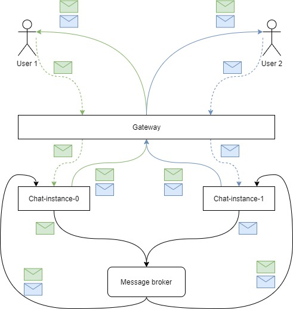

# Chat Service

Сервис для отправки сообщений между пользователями, хранение сообщений

---

## Функциональные требования

- Подключение к чату 1 to 1 через Websocket
- Сохранение сообщений в БД
- Получение истории чата
- Получение списка чатов
- Поддержка добавления различных типов сообщений (обычный текст, отправка предложения о встрече в виде сообщения)
- Сервис должен быть распределенным для горизонтального масштабирования

---

## Проблемы и их решения

**Описание проблемы:** т.к. Chat Service является stateful сервисом (Websocket соединение 2 юзеров и храненимые сообщения должны быть на 1 сервисе), то для роутинга к нужному контейнеру нужен Service Discovery, который будет распределять нагрузку между контейнерами, запоминать адрес и роутить запросы

**Решение:** Использовать message брокер и рассылать сообщения на все инстансы:

[Реактивный масштабируемый чат на Kotlin + Spring + WebSockets / Habr](https://habr.com/ru/amp/publications/552234/)

**Описание проблемы:** что лучше юзать RabbitMQ или Kafka для event-source'инга и распределенного чата?

**Решение:** Использовать rabbitMQ так как нам low latency нужна, а не high throghput

[RabbitMQ vs. Kafka](https://www.confluent.io/learn/rabbitmq-vs-apache-kafka/#:~:text=RabbitMQ%20and%20Apache%20Kafka%20are,quick%20message%20publishing%20and%20deletion.)

## Доменная модель

